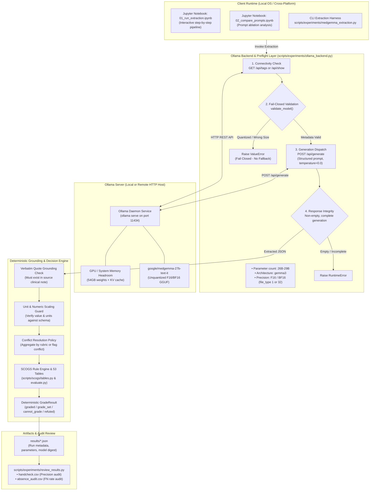
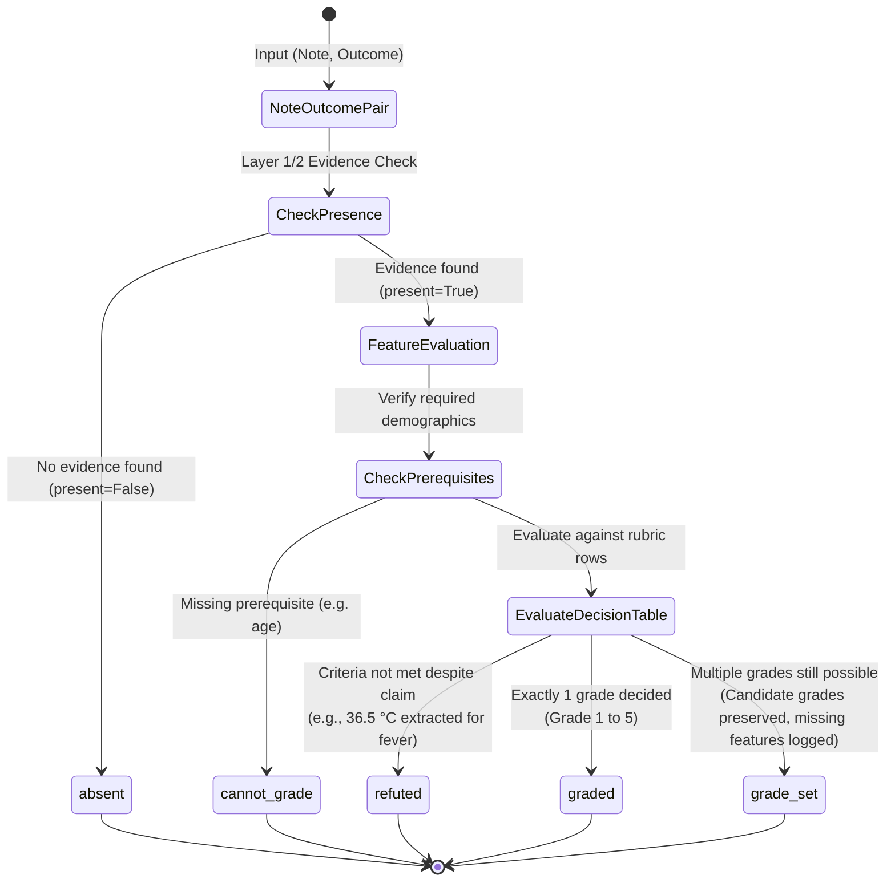

# SCOGS: System Architecture & Workflow Visualizations

This document provides visual diagrams and workflow specifications for the **Sickle Cell Outcome Grading System (SCOGS)** architecture, clinical feature extraction harness, and deterministic grading engine.

---

## 1. Architectural Philosophy: "Derive, Never Predict"

The core invariant of the system is that **grades are derived deterministically, never predicted end-to-end by an LLM**:
- **Feature Extraction (Learned)**: Language models (MedGemma 4B / 27B) extract structured clinical features (labs, vitals, interventions, care settings) accompanied by verbatim quotes.
- **Verification Gate (Deterministic)**: The §2 quote verification contract, unit conversion guards, and conflict policies reject hallucinations before grading.
- **Rule Engine (Deterministic)**: Executable decision tables evaluate verified features using three-valued logic (`True`, `False`, `UNKNOWN`) to yield audit-grade outcomes.

---

## 2. Ollama Server Architecture & Inference Pipeline

The production and local evaluation workflow runs full unquantized **MedGemma 27B** (`google/medgemma-27b-text-it` in native F16 or BF16 precision) served through an **Ollama HTTP API** server. Python never loads CUDA or model weights directly; it interacts with the local or remote Ollama daemon over HTTP with fail-closed model integrity checks:



### Ollama Pipeline Stages

1. **Preflight Model Verification**:
   - Sends `/api/show` query to Ollama before running inference.
   - Enforces 26B–29B parameter count (safeguarding against 2B/4B/7B downscaling).
   - Validates `gemma3` architecture and strictly rejects quantization (accepts only GGUF `F16` or `BF16` file types).
2. **Deterministic Inference (`/api/generate`)**:
   - Structured JSON schema prompt (Stages 0–3 ablation ladder).
   - Greedy decoding (`temperature=0.0`) for maximum reproducibility.
   - Fail-closed transport: empty or truncated responses raise `RuntimeError` rather than returning partial findings.
3. **Safety & Rule Evaluation**:
   - Quotes are verified against note text. Unquoted findings are dropped.
   - Units are verified and converted.
   - Verified features evaluate against deterministic SCOGS tables.
4. **Offline Review Export**:
   - `scripts/experiments/review_results.py` generates human audit sheets (`handcheck.csv`, `absence_audit.csv`) from saved run JSON without querying the model again.

---

## 3. High-Level Multi-Layer System Architecture

```mermaid
flowchart TB
    subgraph L0 ["0. Ingestion & Data Sources"]
        Note["Unstructured SCD Patient Note<br/>(PMC-Patients Corpus)"]
        Schema["SCOGS Feature Schema<br/>(137 Features / 53 Outcomes)"]
        Rubric["Official SCOGS Rubric<br/>(rules.md & SCOGS_Booklet.pdf)"]
    end

    subgraph L1_3 ["Layers 1–3: Parallel Extraction & Reconciliation"]
        direction TB
        subgraph ENGINES ["Three Parallel Extractors"]
            E1["Regex & Numeric Parser<br/>(Exact labs, vitals, drug lists, rare terms)"]
            E2["BioClinical-ModernBERT<br/>(Contextual assertion & implicit clinical spans)"]
            E3["MedGemma 4B / 27B<br/>(Zero-shot rare tail & mention adjudication)"]
        end
        Reconcile["Authority-Based Reconciler<br/>(Domain authority priority over flat voting)"]
        ENGINES --> Reconcile
    end

    subgraph VGATE ["Verification Gate (§2 Contract)"]
        QuoteCheck{"Verbatim Quote Check<br/>(Exact span in note text?)"}
        UnitGuard{"Unit Guard<br/>(Extract number from quote & convert units)"}
        ConflictCheck{"Conflict Policy<br/>(Aggregate by rubric or flag conflict)"}
        
        QuoteCheck -->|Match| UnitGuard
        QuoteCheck -->|Mismatch| HallucinationReject["Reject Hallucination<br/>(Logged in metrics)"]
        UnitGuard -->|Valid| ConflictCheck
        UnitGuard -->|Inconsistent| UnitReject["Reject Unit Mismatch<br/>(e.g., mg/L vs mg/dL)"]
    end

    subgraph L4 ["Layer 4: Deterministic Decision Engine"]
        Engine["Rule Evaluator<br/>(scripts/scogs/evaluate.py)"]
        Tables["53 Decision Tables<br/>(scripts/scogs/tables.py)"]
        Engine <--> Tables
    end

    subgraph L5 ["Layer 5: Review, Audit & Visualization"]
        Dash["Interactive Dashboard<br/>(Verbatim quote highlighting over note)"]
        AuditSheets["Review Sheets (*.csv)<br/>(handcheck.csv: precision<br/>absence_audit.csv: false-negative rate)"]
        Prose["Evidence Rationale<br/>(MedGemma renders record into prose)"]
    end

    Note --> L1_3
    Schema --> L1_3
    Rubric --> Tables

    Reconcile --> QuoteCheck
    ConflictCheck -->|Reconciled Features<br/>(True / False / UNKNOWN)| Engine

    Engine --> Dash
    Engine --> AuditSheets
    Engine --> Prose
```

---

## 4. End-to-End Extraction & Verification Pipeline

```mermaid
flowchart LR
    subgraph IN ["Input"]
        Pair["(Note, Outcome) Pair"]
    end

    subgraph EXTRACT ["LLM Feature Extraction"]
        LLM["MedGemma 4B / 27B<br/>Structured JSON Prompt"]
        JSONOutput["Proposed Features:<br/>• Value<br/>• Verbatim Quote<br/>• Attributed Cause"]
        LLM --> JSONOutput
    end

    subgraph VERIFY ["Grounding & Safety Gates"]
        V1["1. String Exact Match<br/>quote in raw_note?"]
        V2["2. Unit Guard<br/>Convert & verify numeric value"]
        V3["3. Multi-Value Policy<br/>Highest care / aggregation"]
        V1 --> V2 --> V3
    end

    subgraph EVAL ["Rule Engine Evaluation"]
        EvalCore["Table Predicates<br/>(scripts/scogs/predicates.py)"]
        Result["GradeResult Object<br/>status, grade, undecided, missing"]
        EvalCore --> Result
    end

    subgraph OUT ["Review & Storage"]
        JSONLog["results/*.json<br/>(Stamped with run_id)"]
        Sheets["Review Sheets:<br/>• handcheck.csv (Precision)<br/>• absence_audit.csv (FN rate)"]
    end

    Pair --> LLM
    JSONOutput --> V1
    V3 --> EvalCore
    Result --> JSONLog --> Sheets
```



---

## 5. Three-Valued Logic Decision State Machine

The rule evaluator in `scripts/scogs/evaluate.py` evaluates criteria across three truth values (`True`, `False`, `UNKNOWN`) to prevent unmentioned findings from collapsing into negative assertions:



---

## 6. Verification Gate Components

| Gate | Purpose | How It Operates |
| :--- | :--- | :--- |
| **Verbatim Quote Contract (§2)** | Grounding / Anti-Hallucination | Checks whether the extracted quote substring is present verbatim within the note text. Missing quotes trigger immediate value rejection. |
| **Unit Guard** | Numeric Scaling Protection | Extracts the numeric token directly from the verified quote span and validates/converts units (e.g., converting °F to °C or checking mg/dL). Prevents orders-of-magnitude errors. |
| **Multi-Value Reconciliation** | Temporal & Contextual Deconfliction | When multiple measurements appear in a note, values are collapsed via rubric aggregation rules (e.g., "highest level of care reached") or withheld with an explicit conflict flag. |

---

## 7. System Component Directory Map

| Component | Path | Description |
| :--- | :--- | :--- |
| **Rubric Authority** | [`rules.md`](rules.md) | Single source of truth transcribed from [`docs/reference/SCOGS_Booklet.pdf`](docs/reference/SCOGS_Booklet.pdf). |
| **Discrepancy Audit** | [`docs/reference/rules_vs_booklet_discrepancies.md`](docs/reference/rules_vs_booklet_discrepancies.md) | Audit trail of all intentional deviations between printed booklet and code tables. |
| **Ollama Backend & Preflight** | [`scripts/experiments/ollama_backend.py`](scripts/experiments/ollama_backend.py) | Ollama HTTP transport and fail-closed validation for full 16-bit MedGemma 27B. |
| **Ollama Setup Guide** | [`docs/ollama_setup.md`](docs/ollama_setup.md) | Operational guide for Ollama installation, hardware sizing, and GGUF model import. |
| **Cross-Platform Notebooks** | [`notebooks/01_run_extraction.ipynb`](notebooks/01_run_extraction.ipynb), [`notebooks/02_compare_prompts.ipynb`](notebooks/02_compare_prompts.ipynb) | Jupyter notebooks for running extraction and comparing ablation prompt stages. |
| **Feature Definitions** | [`scripts/scogs/features.py`](scripts/scogs/features.py) | Defines the 137 clinical features, data types, units, and ordinal hierarchies. |
| **Predicate Evaluator** | [`scripts/scogs/predicates.py`](scripts/scogs/predicates.py) | Three-valued logic comparison engine supporting `UNKNOWN` propagation. |
| **Decision Tables** | [`scripts/scogs/tables.py`](scripts/scogs/tables.py) | 53 executable decision tables representing the SCOGS rubric. |
| **Rule Evaluator** | [`scripts/scogs/evaluate.py`](scripts/scogs/evaluate.py) | Evaluates (outcome, features) into `GradeResult` instances. |
| **Extraction Harness** | [`scripts/experiments/medgemma_extraction.py`](scripts/experiments/medgemma_extraction.py) | CLI test harness for MedGemma (4B/27B/mock), quote verification, and metrics. |
| **Review Worksheets** | [`scripts/experiments/review_results.py`](scripts/experiments/review_results.py) | Offline generator for precision (`handcheck.csv`) and false-negative (`absence_audit.csv`) review sheets. |
| **Interactive Dashboard** | [`dashboard/index.html`](dashboard/index.html) | Browser interface with interactive quote highlighting on note text (legacy/reference). |
| **Test Suite** | [`tests/`](tests/) | Pytest suite covering tables, schemas, predicates, Ollama workflow, and verifiers. |
